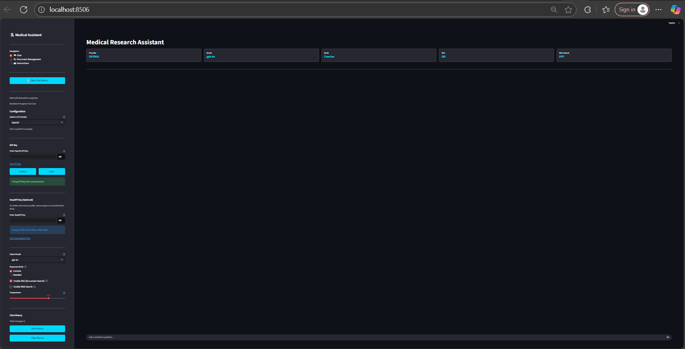
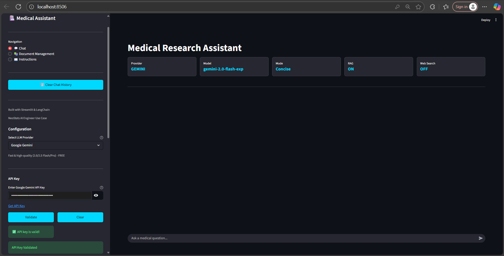
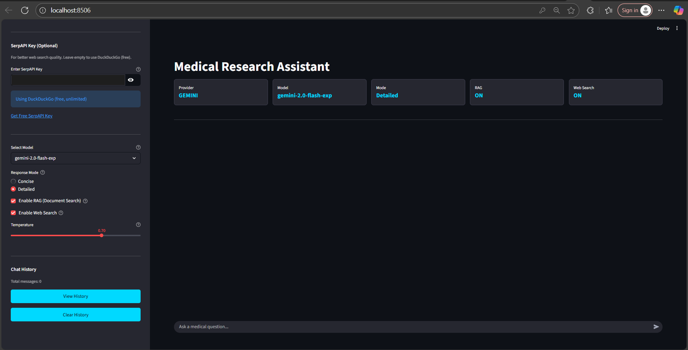
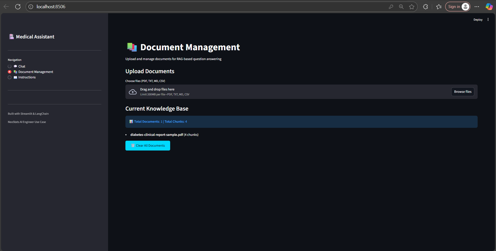
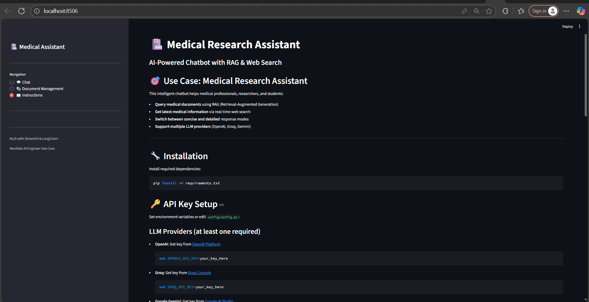
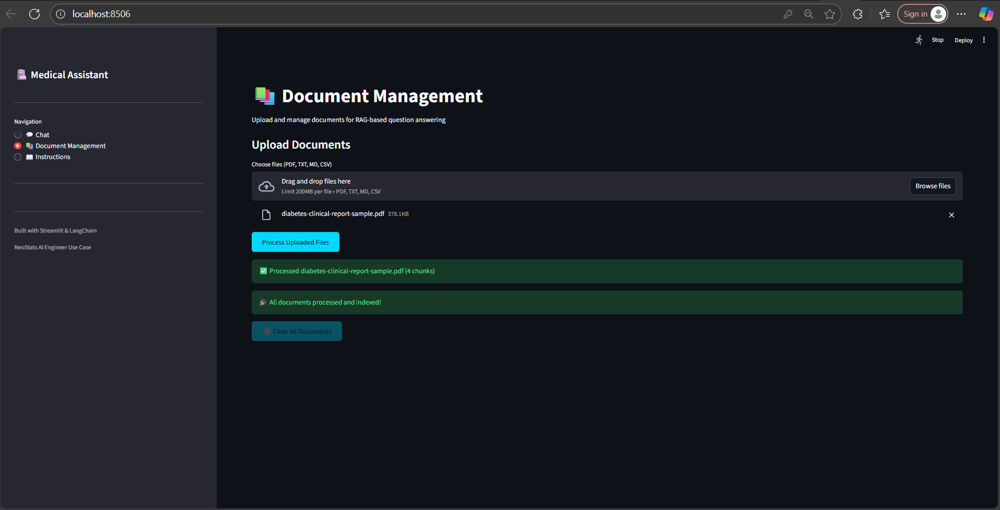
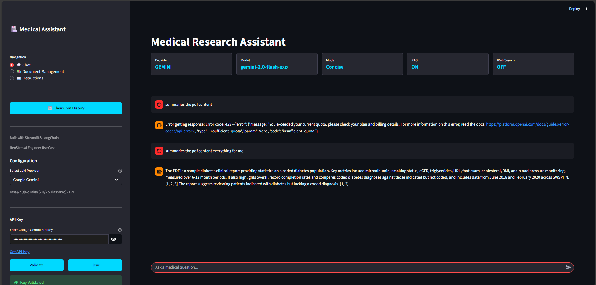
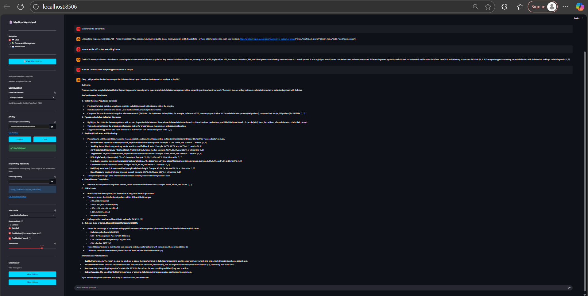
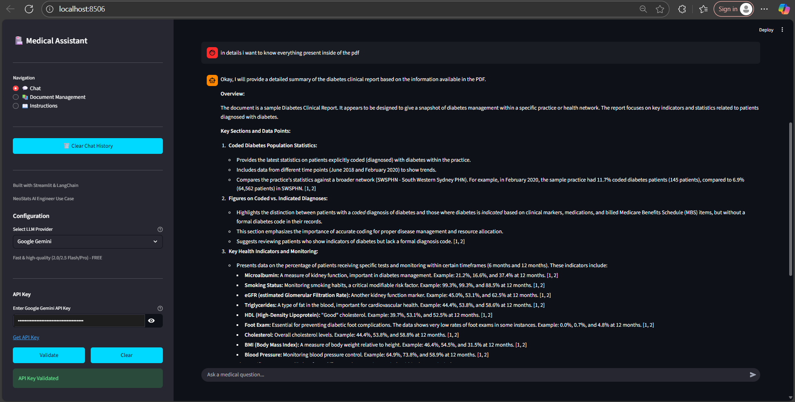

# AegisAIDen — Medical Research Assistant

AI assistant for medical research with **RAG (Retrieval-Augmented Generation)** and **Live Web Search**. Built with Streamlit and LangChain; supports OpenAI, Groq, and Google Gemini.


## Use Case

This chatbot serves as a **Medical Research Assistant** that:
- Answers questions based on uploaded medical documents (research papers, textbooks, clinical guidelines)
- Provides up-to-date medical information via real-time web search
- Offers both concise and detailed response modes
- Supports multiple LLM providers (OpenAI, Groq, Google Gemini)

## Features

### RAG (Retrieval-Augmented Generation)
- **Document Upload**: Support for PDF, TXT, MD, and CSV files
- **Automatic Processing**: Documents are chunked and embedded using sentence transformers
- **Semantic Search**: Find relevant information using vector similarity
- **Source Citations**: Responses include references to source documents

### Live Web Search
- **Real-time Information**: Get the latest medical research and news
- **Multiple Providers**: Serper API, Tavily API, or DuckDuckGo (free)
- **Auto-detection**: Automatically triggers for queries needing current data
- **Formatted Results**: Clean presentation of search results with sources

### Response Modes
- **Concise Mode**: Brief, summarized answers (2-3 sentences)
- **Detailed Mode**: Comprehensive explanations with context and examples

### Multi-Provider LLM Support
- **OpenAI**: GPT-4o, GPT-4o-mini, GPT-3.5-turbo
- **Groq**: Llama 3.1 (70B, 8B), Mixtral
- **Google Gemini**: Gemini 1.5 Pro, Gemini 1.5 Flash

## Quick Start

### Installation

1. **Clone or download the repository**

2. **Install dependencies**:
```bash
pip install -r requirements.txt
```

3. **Set up API keys** (at least one LLM provider required):

**Windows (PowerShell)**:
```powershell
$env:GROQ_API_KEY="your_groq_key_here"
$env:OPENAI_API_KEY="your_openai_key_here"
$env:GOOGLE_API_KEY="your_google_key_here"
```

**Linux/Mac**:
```bash
export GROQ_API_KEY="your_groq_key_here"
export OPENAI_API_KEY="your_openai_key_here"
export GOOGLE_API_KEY="your_google_key_here"
```

**Or edit `config/config.py`** directly (not recommended for production)

4. **Run the application**:
```bash
streamlit run app.py
```

5. **Open your browser** at `http://localhost:8501`

## API Keys

### Required (at least one)
- **OpenAI**: [Get API Key](https://platform.openai.com/api-keys)
- **Groq**: [Get API Key](https://console.groq.com/keys) (Recommended - Fast & Free tier available)
- **Google Gemini**: [Get API Key](https://aistudio.google.com/app/apikey)

### Optional (for web search)
- **Serper API**: [Get API Key](https://serper.dev) - Google Search API
- **Tavily API**: [Get API Key](https://tavily.com) - AI-optimized search
- **DuckDuckGo**: No API key needed (free fallback)

## Project Structure

```
AI_UseCase/
├── app.py                      # Main Streamlit application
├── requirements.txt            # Python dependencies
├── README.md                   # This file
│
├── config/
│   └── config.py              # Configuration and API keys
│
├── models/
│   ├── llm.py                 # LLM model initialization (OpenAI/Groq/Gemini)
│   └── embeddings.py          # Embedding models for RAG
│
├── utils/
│   ├── rag_utils.py           # RAG functionality (document processing, vector search)
│   └── web_search.py          # Web search integration
│
├── uploaded_documents/         # Uploaded files (auto-created)
└── vector_store               # Vector embeddings storage (auto-created)
```

## Screenshots

Below are representative screens in sequence as used during a typical workflow.

### 1) Home Dashboard — Initial View


Shows the landing dashboard with top status cards for Provider, Model, Mode, RAG, and Web Search. Sidebar contains navigation and configuration.

### 2) Provider Setup — Gemini with Key Validated


Gemini selected as provider, API key validated, RAG enabled, concise mode active. Ready to chat or manage documents.

### 3) Configuration — Detailed Mode with Web Search


Detailed response mode enabled with both RAG and Web Search ON. Optional DuckDuckGo free search is selected; temperature and history controls visible.

### 4) Document Management — Knowledge Base Overview


Upload area and the current knowledge base list. Shows the uploaded sample PDF indexed into chunks for RAG.

### 5) Built‑in Instructions Guide


In‑app documentation covering installation, API key setup, and provider configuration for quick onboarding.

### 6) Document Processing — Success Notifications


Confirmation banners after processing the uploaded PDF. All documents are embedded and indexed for retrieval.

### 7) RAG Answer — Summarize Uploaded PDF


User asks to summarize the PDF. The app retrieves relevant chunks and produces a concise answer grounded in the uploaded document.

### 8) Provider Quota Handling & Verbose Output


Example session showing provider quota errors surfaced clearly, alongside verbose context. RAG continues working with available providers.

### 9) Detailed Mode — Structured Summary


Comprehensive, well‑structured summary with key sections, indicators, and references generated in Detailed mode.

## Usage Examples

### Example 1: Query Uploaded Documents
1. Go to **Document Management**
2. Upload medical research papers (PDF)
3. Click "Process Uploaded Files"
4. Go to **Chat** and ask: *"What does the uploaded paper say about diabetes treatment?"*

### Example 2: Get Latest Medical Information
1. Go to **Chat**
2. Enable "Web Search"
3. Ask: *"What are the latest treatments for Alzheimer's disease in 2024?"*

### Example 3: Combine RAG + Web Search
1. Upload clinical guidelines
2. Enable both RAG and Web Search
3. Ask: *"Compare the uploaded guidelines with recent research on hypertension management"*

## Configuration

### Response Modes
- **Concise**: Max 150 tokens, brief answers
- **Detailed**: Max 1000 tokens, comprehensive explanations

### RAG Settings (in `config/config.py`)
```python
CHUNK_SIZE = 1000          # Characters per chunk
CHUNK_OVERLAP = 200        # Overlap between chunks
TOP_K_RESULTS = 3          # Number of relevant chunks to retrieve
```

### Embedding Model
- Default: `sentence-transformers/all-MiniLM-L6-v2` (384 dimensions)
- Free, runs locally, no API key needed

## Features Implemented

**RAG Integration**
- Document upload and processing
- Vector embeddings using sentence transformers
- Semantic search with cosine similarity
- Context injection into LLM prompts

**Live Web Search**
- Multiple search providers (Serper, Tavily, DuckDuckGo)
- Automatic fallback mechanism
- Smart query detection for web search triggers

**Response Modes**
- Concise mode (brief answers)
- Detailed mode (comprehensive explanations)
- Configurable via UI

**Multi-Provider Support**
- OpenAI, Groq, and Gemini integration
- Dynamic provider selection
- Automatic API key detection

**Modern UI**
- Clean, intuitive interface
- Real-time status indicators
- Document management dashboard
- Configuration sidebar

## Deployment

### Deploy to Streamlit Cloud

1. **Push to GitHub**:
```bash
git init
git add .
git commit -m "Initial commit"
git remote add origin <your-repo-url>
git push -u origin main
```

2. **Deploy**:
   - Go to [Streamlit Cloud](https://streamlit.io/cloud)
   - Click "New app"
   - Select your repository
   - Set main file path: `AI_UseCase/app.py`
   - Add secrets (API keys) in Advanced Settings
   - Click "Deploy"

3. **Add Secrets** (in Streamlit Cloud dashboard):
```toml
GROQ_API_KEY = "your_key_here"
OPENAI_API_KEY = "your_key_here"
GOOGLE_API_KEY = "your_key_here"
SERPER_API_KEY = "your_key_here"
```

## Testing

### Test RAG Functionality
1. Upload a sample medical document
2. Verify it appears in Document Management
3. Ask a question related to the document content
4. Check if the response cites the source

### Test Web Search
1. Enable web search in sidebar
2. Ask: "Latest COVID-19 vaccine news"
3. Verify search results appear in response

### Test Response Modes
1. Ask the same question in Concise mode
2. Switch to Detailed mode and ask again
3. Compare response lengths

## Troubleshooting

| Issue | Solution |
|-------|----------|
| No API keys found | Set environment variables or edit `config/config.py` |
| RAG not working | Upload documents in Document Management page |
| Web search failing | Check internet connection or try DuckDuckGo (no API key) |
| Slow responses | Switch to faster model (e.g., GPT-4o-mini, Llama 3.1-8b) |
| Import errors | Run `pip install -r requirements.txt` |

## Technical Stack

- **Frontend**: Streamlit
- **LLM Framework**: LangChain
- **Embeddings**: Sentence Transformers
- **Vector Search**: Custom implementation with NumPy
- **Document Processing**: PyPDF2
- **Web Search**: Serper/Tavily/DuckDuckGo APIs

## Use Case Justification

**Why Medical Research Assistant?**

1. **Real-world Impact**: Helps healthcare professionals access and synthesize medical information quickly
2. **RAG Necessity**: Medical knowledge is vast and constantly updated - RAG allows querying specific documents
3. **Web Search Value**: Medical research evolves rapidly - web search provides latest findings
4. **Response Modes**: Medical professionals need both quick summaries and detailed explanations

## License

This project is created for the NeoStats AI Engineer Use Case challenge.

## Author

Built for NeoStats AI Engineer Challenge

---

**Note**: This chatbot is for educational and research purposes. Always consult qualified healthcare professionals for medical advice.
